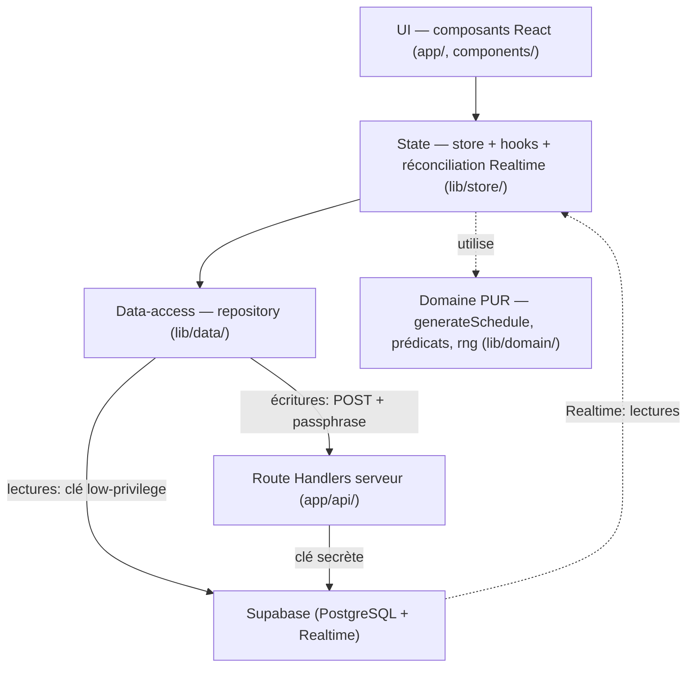
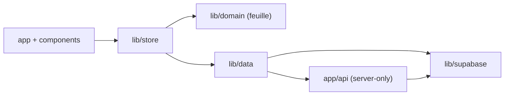
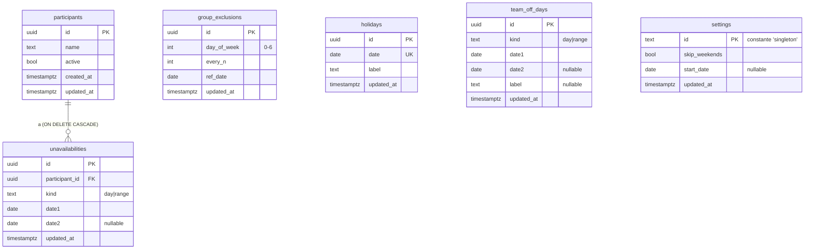
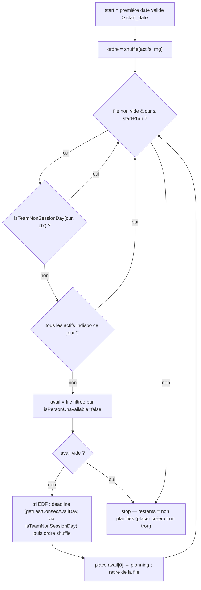

# Architecture Spine — Daily Wheel

## Design Paradigm

**Architecture en couches** avec un **domaine pur en feuille** et un **flux de données asymétrique** (lectures client-direct, écritures via serveur).



| Couche | Répertoire | Rôle | Dépend de |
| --- | --- | --- | --- |
| Domaine | `lib/domain/` | Algorithme EDF + prédicats de contrainte. Pur. | rien |
| Data-access | `lib/data/` | Lectures (clé low-privilege) + écritures (fetch vers `app/api/`). Seul à connaître le schéma. | `lib/supabase`, `app/api` |
| State | `lib/store/` | Copie de travail client, hooks, abonnement Realtime, réconciliation. | `lib/data`, `lib/domain` |
| UI | `app/`, `components/` | Rendu, édition inline. | `lib/store` |
| Serveur | `app/api/` | Proxy d'écriture gardé par passphrase, écrit via la clé secrète. | `lib/supabase` (admin) |

## Invariants & Rules



> Les dépendances descendent uniquement. Le domaine est une feuille : rien ne le force à dépendre vers l'extérieur (c'est ce qui garantit sa testabilité).

### AD-1 — Cœur EDF = fonction pure `generateSchedule(input, rng)` [ADOPTED]

- **Binds:** FR11, FR14, Epic 4, exigences de test.
- **Prevents:** algorithme soudé au DOM/React/Supabase → intestable, parité NFR9 invérifiable, divergence entre code de prod et code testé.
- **Rule:** Toute la logique de génération vit dans `lib/domain/`, sans aucun import de React, du DOM, ni de Supabase. Entrées = données + un `rng`. Sortie = `{ planning, nonPlanifiés }`. Le store appelle ce module ; les composants n'implémentent aucune logique de planning.

### AD-2 — Aléa injecté et seedable [ADOPTED]

- **Binds:** NFR7, NFR9.
- **Prevents:** non-déterminisme empêchant la rejouabilité et la comparaison de parité.
- **Rule:** `generateSchedule` reçoit un `rng` en paramètre, d'interface **`rng: () => number`** renvoyant `[0,1)` (compatible `Math.random`, ex. mulberry32 seedé). La prod passe un seed aléatoire ; les tests passent un seed fixe. Aucun appel à `Math.random()` à l'intérieur du domaine.

### AD-3 — Deux prédicats de contrainte, `isTeamNonSessionDay` comme source unique [ADOPTED]

- **Binds:** FR7, FR8, FR11, Epic 3, Epic 4.
- **Prevents:** une contrainte (férié/off) ajoutée à la boucle de génération mais oubliée dans le calcul de deadline EDF → fenêtre de disponibilité fausse → planning faux et rupture de parité **silencieuse**.
- **Rule:** Deux prédicats canoniques dans `lib/domain/`, **purs et recevant leurs contraintes en arguments** (aucune lecture de store) :
  - `isTeamNonSessionDay(date: string /*YMD*/, ctx: { skipWeekends, groupExclusions, holidays, teamOffDays }): boolean` = week-end (si option) **ou** exclusion de groupe **ou** jour férié **ou** jour off d'équipe → aucun Daily ce jour (pas un trou).
  - `isPersonUnavailable(person, date): boolean` = indisponibilité individuelle (jour/plage).
  `isTeamNonSessionDay` est l'**unique** source de vérité du « jour neutralisé » et doit être branché **à la fois** dans la boucle de génération **et** dans le calcul de deadline EDF (`getLastConsecAvailDay`). Un **test paramétré** prouve que les deux sites d'appel utilisent le même prédicat. Les tables `holidays` et `team_off_days` restent séparées (distinction métier) ; leur fusion en prédicat est la seule couture.

### AD-4 — Supabase est la source canonique de l'état [ADOPTED]

- **Binds:** FR13, toutes les écritures.
- **Prevents:** deux clients divergeant sur des copies locales jamais alignées sur la base.
- **Rule:** Le store client est une **copie de travail** hydratée au chargement. Aucune décision métier ne se prend sur des données non confirmées par la base — exception : l'affichage optimiste, qui se réconcilie (voir AD-5/AD-6/AD-16).

### AD-5 — Écritures optimistes avec rollback [ADOPTED]

- **Binds:** édition inline (§3 PRD), FR1-FR10.
- **Prevents:** latence réseau visible à chaque clic ; état affiché incohérent en cas d'échec d'écriture non géré.
- **Rule:** Une mutation met à jour le store immédiatement, déclenche l'écriture en arrière-plan (AD-7), et **rollback + message d'erreur** selon la classe d'erreur (AD-17) si l'écriture échoue. Pas de bouton « Enregistrer » global.

### AD-6 — Fraîcheur inter-clients par Supabase Realtime + réconciliation [ADOPTED]

- **Binds:** FR13.
- **Prevents:** FR13 mort silencieusement (aucun événement livré) ; écho Realtime d'une mutation locale provoquant double-application / clignotement.
- **Rule:**
  - La migration **active** Realtime : ajoute les 6 tables à la publication `supabase_realtime` et pose `REPLICA IDENTITY FULL`. La Story 1.2 doit prouver qu'un événement arrive.
  - Un abonnement Realtime (côté lecture, clé low-privilege) maintient le store à jour entre clients.
  - L'écho d'une **propre** écriture est dédupliqué selon AD-15 (match `id` ET `updated_at`).
  - Le store **se re-hydrate à chaque (re)connexion** Realtime (les connexions publiques se coupent ~24 h ; le client se reconnecte automatiquement).

### AD-7 — Chemins de données asymétriques [ADOPTED]

- **Binds:** NFR2, NFR3, NFR8, toutes les opérations de données.
- **Prevents:** écritures non gardées ; exposition de la clé secrète côté client.
- **Rule:**
  - **Lectures** : `lib/data/` → Supabase via la clé **low-privilege** (client-direct), y compris l'abonnement Realtime.
  - **Écritures** : `lib/data/` → `POST` vers une **Route Handler Next.js** (`app/api/`) qui valide la passphrase puis écrit via la clé **secrète**.
  Aucune écriture ne part directement du client vers Supabase.

### AD-8 — Sécurité B2 : passphrase d'équipe qui verrouille réellement les écritures [ADOPTED]

- **Binds:** NFR3, NFR8, toutes les écritures.
- **Prevents:** modification/suppression des données par quiconque connaît l'URL (une garde purement UI serait contournable via l'endpoint public).
- **Rule:** Toute écriture exige une passphrase d'équipe partagée, transmise en header `x-team-passphrase` et vérifiée **côté serveur** dans la Route Handler avant d'écrire. Ce n'est pas un login (pas de comptes), juste un secret partagé unique.

### AD-9 — Politiques RLS : lecture ouverte, écriture interdite à la clé publique [ADOPTED]

- **Binds:** NFR3.
- **Prevents:** écriture directe via la clé publique contournant la passphrase.
- **Rule:** RLS **activé** sur les 6 tables applicatives uniquement. `SELECT` autorisé au rôle public (`anon`/publishable) ; `INSERT`/`UPDATE`/`DELETE` **non** accordés. Seules les Route Handlers serveur écrivent (la clé secrète contourne RLS). La surface de policy existe déjà pour un futur login.

### AD-10 — Secrets : clé secrète et passphrase server-only [ADOPTED]

- **Binds:** NFR8.
- **Prevents:** fuite de la clé secrète / passphrase dans le bundle client.
- **Rule:** Clé **secrète** Supabase (`sb_secret_…` ou legacy `service_role`) et passphrase = variables d'environnement **serveur** uniquement (Vercel), jamais préfixées `NEXT_PUBLIC_`. Seules `NEXT_PUBLIC_SUPABASE_URL` et la **clé low-privilege** (`sb_publishable_…` ou legacy `anon`) sont exposées au client. La règle est **agnostique au format de clé** (les clés legacy `anon`/`service_role` sont en cours de dépréciation chez Supabase). `lib/supabase/` expose deux clients : low-privilege (navigateur) et secret (importé **uniquement** par `app/api/`).

### AD-11 — `lib/data/` est le seul point de contact Supabase + règle de dépendance [ADOPTED]

- **Binds:** NFR2, toutes les opérations de données.
- **Prevents:** requêtes dispersées dans les composants, duplication du mapping table↔code, recouplage du domaine pur.
- **Rule:** Aucun composant ni hook ne fait `supabase.from(...)` en direct — tout passe par `lib/data/`. Les dépendances descendent (UI → state → data-access) et ne remontent jamais ; `lib/domain/` ne dépend de personne.

### AD-12 — Parité NFR9 vérifiée par test golden (périmètre legacy) [ADOPTED]

- **Binds:** NFR9, Story 4.2 (AC6).
- **Prevents:** régression de parité non détectée ; confusion entre parité et extension comportementale.
- **Rule:** Un test golden rejoue un jeu de données + un seed fixe dans `generateSchedule` et compare à un fixture de référence dérivé de l'ancienne page — il couvre **uniquement les contraintes legacy** (week-ends, exclusions de groupe, indisponibilités). L'interaction **fériés / jours off** avec la deadline EDF est une **extension** comportementale (absente de l'ancienne page) et porte ses **propres tests dédiés**, distincts de la parité. NFR9 (legacy) est satisfait **si et seulement si** le test golden passe.

### AD-13 — Un seul projet Supabase, config par environnement Vercel [ADOPTED]

- **Binds:** NFR1, NFR2, déploiement.
- **Prevents:** dérive de configuration entre environnements ; dimension opérationnelle laissée silencieuse.
- **Rule:** Un projet Supabase unique. Variables d'env par environnement Vercel (Production = Preview, même base) ; `.env.local` en dev pointe sur le même projet. Le schéma vit dans `supabase/migrations/` (SQL versionné), **appliqué via la Supabase CLI (`supabase db push`)** ou le SQL editor. La CI exécute les tests du domaine (Vitest) ; le déploiement Vercel est **conditionné aux tests verts**.

### AD-14 — Contrat d'écriture : une Route Handler par table, enveloppe unique [ADOPTED]

- **Binds:** AD-7, AD-8, toutes les écritures.
- **Prevents:** deux callers envoyant des protocoles incompatibles (champ partiel vs ligne entière, endpoints divergents) → `lib/data/` parlant deux protocoles, sémantiques de mise à jour incohérentes.
- **Rule:** **Une** Route Handler par table (`app/api/<table>/route.ts`). Corps unique `{ op: 'insert' | 'update' | 'delete', id?, data? }`, passphrase en header `x-team-passphrase`. `update` = **patch partiel**. Le serveur applique une **allowlist de colonnes** par table avant écriture.

### AD-15 — Ids serveur + versioning pour la réconciliation [ADOPTED]

- **Binds:** FR13, AD-5, AD-6.
- **Prevents:** écho INSERT avec id non vu (double-render) ; dédup-par-id supprimant à tort l'UPDATE d'un **autre** client (divergence permanente).
- **Rule:** Le **serveur** possède les ids (uuid `default gen_random_uuid()`). Toutes les tables écrivables portent `updated_at` (`timestamptz`, mis à jour côté serveur à chaque write). La déduplication d'un écho Realtime se fait sur **match `id` ET match `updated_at`** ; sinon l'événement est appliqué.

### AD-16 — Conflits same-row : Last-Write-Wins ordonné serveur [ADOPTED]

- **Binds:** AD-4, AD-5, AD-6.
- **Prevents:** lost update invisible quand deux clients éditent la même ligne (le dédup masque la régression aux deux UIs).
- **Rule:** Résolution **Last-Write-Wins par ligne**, ordonnée par `updated_at` serveur. L'écho Realtime (ou un refetch) fait **autorité** sur la réponse de l'écriture optimiste locale.

### AD-17 — Taxonomie d'erreurs d'écriture typée [ADOPTED]

- **Binds:** AD-5, AD-8.
- **Prevents:** client incapable de distinguer auth / validation / transitoire → retry d'une mauvaise passphrase, ou perte d'une edit rejouable.
- **Rule:** La Route Handler renvoie des classes HTTP typées, mappées côté client vers un `WriteError` :
  - `401` auth (passphrase invalide) → re-prompt, **pas** de retry, **pas** de rollback silencieux ;
  - `400` validation → **rollback** de l'optimiste ;
  - `409` conflit → re-hydrater puis ré-appliquer (AD-16) ;
  - `5xx` transitoire → retry possible.

## Consistency Conventions

| Concern | Convention |
| --- | --- |
| Nommage | Tables/colonnes Supabase en `snake_case` (PRD §4) ; types/fonctions TS en `camelCase`/`PascalCase`. |
| Dates | Dates métier = chaînes `YYYY-MM-DD` manipulées en **local** ; jamais `toISOString()`/UTC (évite le décalage d'un jour). Type Postgres `date` ; c'est aussi le wire-format des écritures. |
| Settings | Ligne unique : `id` = constante littérale **`'singleton'`** + `upsert` (jamais d'`insert` multiple). |
| Suppression | `ON DELETE CASCADE` sur `unavailabilities.participant_id` au niveau DB (FR4). |
| Écritures | Optimistes (store d'abord) → `POST` vers `app/api/<table>` avec `x-team-passphrase` → rollback/retry selon AD-17. |
| Versioning | `updated_at` (timestamptz, serveur) sur toute table écrivable ; sert dédup Realtime + LWW. |
| Realtime | Abonnement côté lecture (low-privilege) ; dédup écho par `id`+`updated_at` ; re-hydratation à la (re)connexion. |
| Secrets | `NEXT_PUBLIC_*` = client ; clé secrète + passphrase = serveur uniquement. Agnostique au format de clé Supabase. |
| Langue/format | UI et formats de date 100 % français (NFR4). |

## Stack

| Name | Version |
| --- | --- |
| Next.js (App Router) | 16.2.x |
| React | 19.2 |
| @supabase/supabase-js | 2.108.x |
| TypeScript | 5.1+ |
| Node.js | 20.9+ (imposé par Next 16) |
| Tests | Vitest (tests du domaine + intégration data) |
| Plateforme hébergement | Vercel |
| Base de données | Supabase (PostgreSQL + Realtime) |
| Starter | `create-next-app --app --ts --eslint` (sans Tailwind — on ratifie la charte CSS existante ; sans `src/`) |

## Structural Seed

```text
app/
  page.tsx              # écran principal unique (cartes Participants / Options / Résultat)
  api/                  # Route Handlers d'écriture, SERVER-ONLY — une par table, valide la passphrase, écrit via la clé secrète
    participants/route.ts
    unavailabilities/route.ts
    group_exclusions/route.ts
    holidays/route.ts
    team_off_days/route.ts
    settings/route.ts
components/             # UI React (cartes, panneaux repliables, tableau planning)
lib/
  domain/               # generateSchedule, isTeamNonSessionDay, isPersonUnavailable, rng — PUR
  data/                 # repository : lectures (low-privilege) + écritures (fetch vers /api) — seul à connaître le schéma
  supabase/             # init clients : low-privilege (browser) + secret (server-only)
  store/                # état client, hooks, abonnement Realtime, réconciliation
supabase/
  migrations/           # SQL versionné : tables + updated_at + RLS + publication realtime
```

### Modèle de données (graine, conforme PRD §4 + AD-15)



### Flux génération du planning (invariants algorithmiques)



> Invariant : chaque participant est placé **au plus une fois** (rotation one-shot, la file se vide). Aucun trou n'est jamais créé.

## Capability → Architecture Map

| Capability / Area | Lives in | Governed by |
| --- | --- | --- |
| Génération EDF + non-planifiés (FR11, FR12, FR14, Epic 4) | `lib/domain/generateSchedule` | AD-1, AD-2, AD-3, AD-12 |
| Contraintes équipe : fériés, off, exclusions (FR6, FR7, FR8, Epic 3) | `lib/domain` (prédicat) + `lib/data` + `app/api` | AD-3, AD-14 |
| Participants & indispos (FR1-FR5, Epic 2) | `components/` + `lib/data` + `app/api` | AD-5, AD-7, AD-11, AD-14, conventions (cascade) |
| Persistance partagée & temps réel (FR13) | `lib/data`, `lib/store`, `supabase/migrations` | AD-4, AD-5, AD-6, AD-15, AD-16 |
| Options (week-ends, date début) (FR9, FR10, Epic 4) | `settings` + `lib/store` | conventions (settings 'singleton', upsert) |
| Sécurité / accès mono-équipe (NFR3, NFR8) | `app/api/`, `supabase/migrations` (RLS) | AD-7, AD-8, AD-9, AD-10, AD-14, AD-17 |
| Fondations & déploiement / CI (NFR1, Epic 1) | `create-next-app`, Vercel, `supabase/migrations`, CI | AD-13, Stack |

## Divergences assumées vs PRD

> Décisions de cette spine qui **surclassent** le PRD ; à reporter dans `docs/prd.md` pour éviter une dérive amont/aval.

- **Sécurité (AD-7, AD-8, AD-14)** surclasse **NFR3 / §4** : le PRD prévoyait écriture directe via clé `anon` + RLS et « pas d'API routes obligatoires ». La spine introduit une passphrase d'équipe et un **proxy d'écriture serveur** (Route Handlers), les écritures `anon` étant refusées par RLS (AD-9).
- **`updated_at` sur toutes les tables (AD-15)** : ajout au modèle de données §4, requis par la réconciliation Realtime/optimiste.

## Deferred

- **Import one-shot des données `localStorage`** de l'ancienne page. *Reprise si :* la ressaisie manuelle est jugée trop coûteuse (PRD : optionnel).
- **Pré-remplissage des jours fériés via API officielle française.** *Reprise si :* la saisie manuelle devient pénible (PRD §4).
- **Login/auth réel (comptes individuels, traçabilité).** *Reprise si :* besoin d'audit ou de contrôle d'accès par personne ; la surface RLS est déjà en place (AD-9).
- **Fusion `holidays`/`team_off_days` via colonne `category`.** *Reprise si :* la distinction métier n'apporte plus de valeur (PRD §4).
- **Pagination / horizon > 1 an / équipes > 50.** Hors-cible NFR6 ; *reprise si* l'échelle change.
- **Realtime binaire / présence / résolution de conflit avancée (CRDT).** LWW (AD-16) suffit à cette échelle ; *reprise si* l'édition concurrente devient fréquente et conflictuelle.
